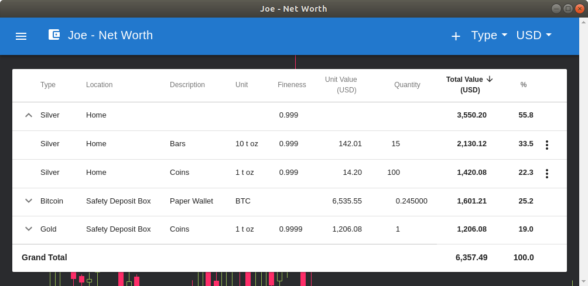

<h1 align="center">
  
</h1>

  
  
  
  
  

<h1 align="center">Net Worth Desktop</h1>

If you primarily store your wealth in 'unconventional' assets like precious metals and cryptocurrencies, it seems
difficult to get an overview of your current financial situation.

Net Worth aims to make this a little easier. In a nutshell, the application presents your precious metal and
cryptocurrency holdings in a groupable and sortable table, which allows you to quickly see how your net worth is spread
among the different asset types and locations.

## Getting Started

### Installation

Net Worth is available through [Snapcraft Store](https://snapcraft.io/net-worth) and others.

Alternatively, you can also
[use the browser-based variant of Net Worth](https://github.com/andreashuber69/net-worth/blob/master/README.md#installation).
The usage is identical for all variants, the desktop ones just don't have the internet browser controls, like e.g. the
address bar.

### Usage

In the toolbar on the left there's a menu with the usual suspects **New**, **Open...**, **Save**, **Save As...** and
**About**. On the right, you'll find a button to add a new asset and controls to change the asset grouping and the
valuation currency.

In the table, clicking on a row representing an asset group will expand/collapse it. For example, in the screenshot
above, the **Silver** group is expanded, such that the grouped assets become visible. Individual assets can be edited
and deleted with the triple-dot menu at the end of each row. Some columns can be sorted by clicking on their headers.

### Privacy

- **Data Storage**: The data you enter into Net Worth is only ever stored locally and can be saved to a file on your
  hard drive.
- **Queries**: The application queries precious metal prices and currency exchange rates
  ([quandl.com](https://quandl.com)) plus crypto currency prices ([coinmarketcap.com](https://coinmarketcap.com)). For
  crypto currencies, you have the option to also track your balance. If you choose to do so, the application will also
  send your public address to an online service like e.g. [blockchain.info](https://blockchain.info).
- **Encryption**: All queries are always encrypted (https), but of course the owners of the respective services will
  have access to the contents of the queries (which can be attributed to you via your IP address). If you have concerns
  about that, you should use a reputable VPN provider or even TOR.

## Features

- Supported precious metals: **Silver**, **Palladium**, **Platinum**, **Gold**
- Supported crypto currencies: **Bitcoin**, **Litecoin**, **Ethereum Classic**, **ERC20 Tokens**, **Ethereum**,
  **Bitcoin Gold**, **Dash**, **Zcash**. Others will be implemented depending on demand.
- Assets can be grouped according to asset type or location.
- Assets other than precious metals and cryptos can be added as (manually valued) Misc assets.
- Liabilities can be added as negatively valued Misc assets.
- Supported valuation currencies: 27 fiat currencies plus silver ounces (XAG), gold ounces (XAU) and Bitcoin (BTC)
- Intuitive, flexible user interface that auto-adapts to almost any screen size.
- Free, open-source, no ads
- Works on almost any platform, including mobile phones and Raspberry Pis.

## Known Issues / Feedback

To see the known issues, ask questions, report problems or suggest improvements, please use the following issue
trackers:

- Download, Installation & Deinstallation:
  [Net Worth Desktop Issue Tracker](https://github.com/andreashuber69/net-worth-desktop/issues)
- Anything else: [Net Worth Issue Tracker](https://github.com/andreashuber69/net-worth/issues)

## Source Code

The source code and full change history is available at <https://github.com/andreashuber69/net-worth-desktop> and
<https://github.com/andreashuber69/net-worth>. You can also review the code with the developer tools while your browser
is directed to the [browser-based variant of Net Worth](https://andreashuber69.github.io/net-worth).
